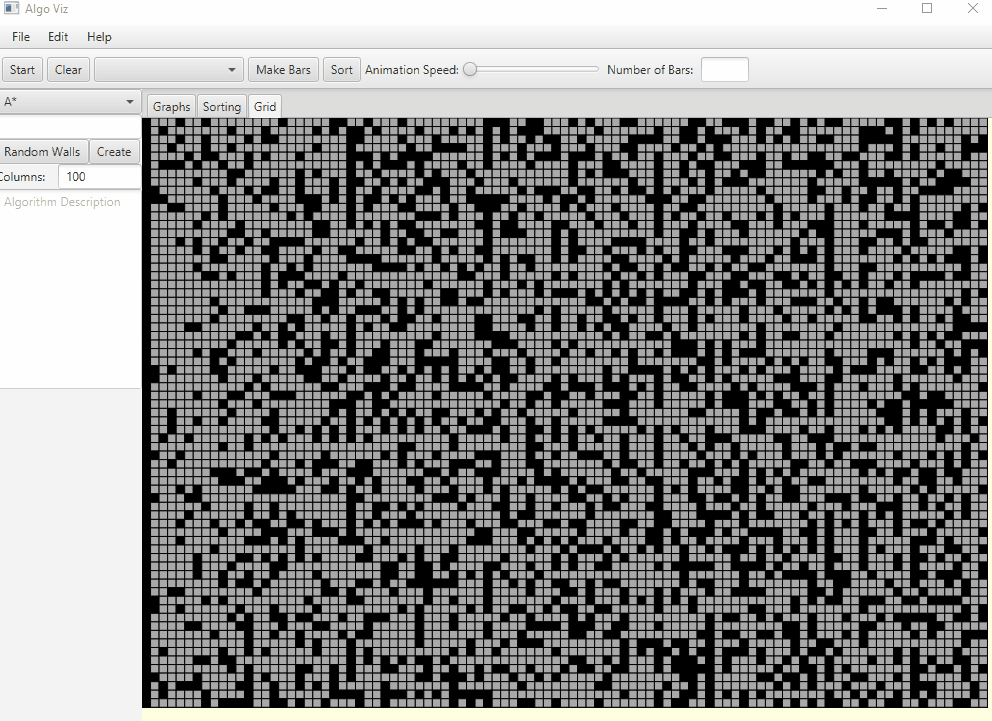
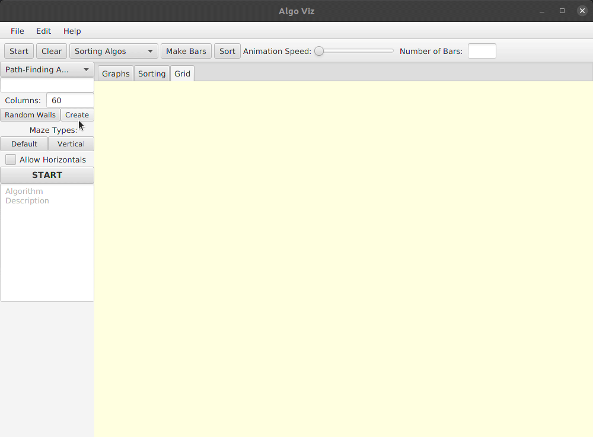
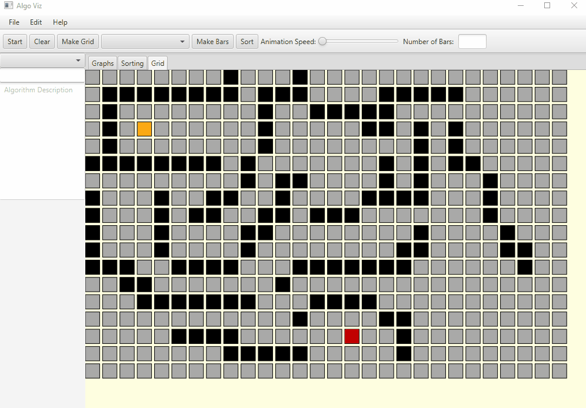
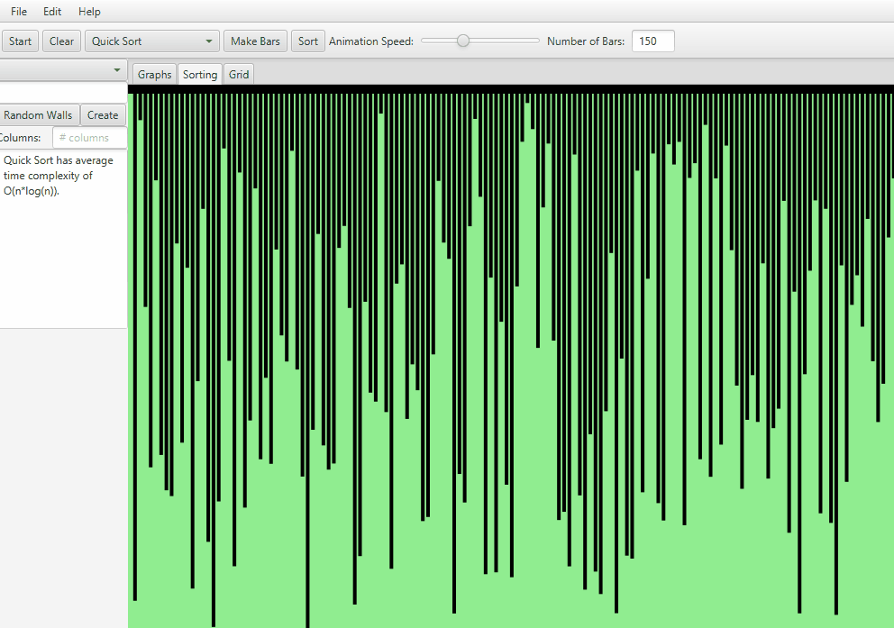
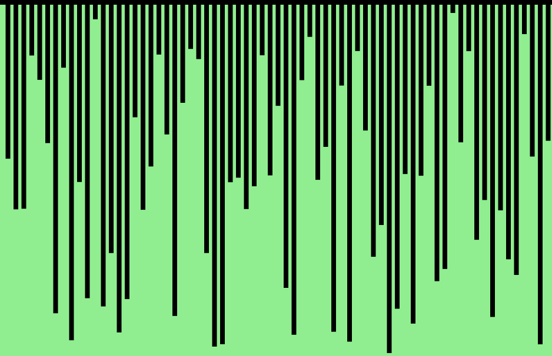

# Algorithm-Visualizer-Java
Personal project I made using JavaFX to visualize various types of sorting and path-finding algorithms.
The sorting algorithms are working properly. The path finding algorithms are still being worked on. 

Setup instructions at the bottom.

A* Path-Finding Algorithm

DFS Maze Generation

Dijkstra's Shortest Path Algorithm: 

Quick Sort Algorithm:

Here is an example of Heap Sort: (sorry, I know the flashing is a bit annoying, I'll fix the colors)

Coctail Sort:

# Setup
  
  1) Create a new JavaFX application. This project uses Java JDK 11 and JavaFX 2
  2) Remove all files in the created src folder
  3) Clone / Fork this repository and place the entire thing in the src folder you just cleared out
  4) Build and run the application!
  5) Create an issue or pull request if you find some problem (I know there are a few) and I will try to keep up to date with pull requests.
